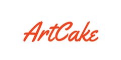

<h4 align="center">
  
</h4>
<strong>
<h3 align="left">About Project:</h3>
This project aims to streamline the operations of both brick-and-mortar and online cake shops, including startups. Your clients can place orders, while you can efficiently manage and work remotely, oversee your employees, and handle orders. This represents the future—a modern approach to making your business more successful.

To implement this project, we employ the following technologies: Java 17, Gradle, TestNG, Rest Assured, Git, and Jenkins. Additionally, we have integrated Logger and Gradle Wrapper. Our documentation tools include TestLink and Jira. We have also created tables for combinatorics and exhaustive analyses, as well as state transition diagrams. Naturally, we encountered challenges while working with GitHub, managing numerous branches, performing merges, ensuring correct dependencies in the project, establishing database tables in the BackEnd, writing accurate tests, and configuring the Gradle Wrapper.
</strong>

<h3 align="left">Languages and Tools:</h3>
<div align="center">
    <a href="https://git-scm.com/" target="_blank" rel="noreferrer">
        
    </a>
    <a href="https://www.java.com" target="_blank" rel="noreferrer">
        
    </a>
    <a href="https://www.jenkins.io" target="_blank" rel="noreferrer">
        
    </a>
    <a href="https://rest-assured.io/" target="_blank" rel="noreferrer">
        
    </a>
</div>

### Dependencies:

```gradle
    implementation 'org.testng:testng:7.8.0'
    implementation 'io.rest-assured:rest-assured:5.3.1'
    implementation 'com.google.code.gson:gson:2.10.1'
    implementation 'ch.qos.logback:logback-classic:1.4.11'

    annotationProcessor 'org.projectlombok:lombok:1.18.28'
    testAnnotationProcessor 'org.projectlombok:lombok:1.18.28'
``` 

## Technology:
- **Stack**: JAVA 17, RestAssured, Gradle, IntelliJ IDEA 2023. 
* [Bug Report](https://drive.google.com/file/d/1lGPW8iyS4zUpa70Hw-4em2RsYXvpv1Mi/view?usp=sharing)
* [Combinatorics](https://docs.google.com/spreadsheets/d/1zQ0h7WvOutvFR0TaTQO4spvBDTTDVvL-/edit?usp=sharing&ouid=108218146103269297215&rtpof=true&sd=true)
* [ExhaustiveTesting](https://docs.google.com/spreadsheets/d/1PtDNVdbnNxmiD69ewNuRi4A8x2tJqN62/edit?usp=sharing&ouid=108218146103269297215&rtpof=true&sd=true)
* [General Test Plan Metrics](https://drive.google.com/file/d/1l5gXy35zWAKsr7RjzLtw9ZZZeCBFfChg/view?usp=sharing)
* Gradle Wrapper
    
* Jenkins
* [JIRA](https://ait-learn.atlassian.net/jira/software/projects/G4/boards/17)
* [Logger](https://drive.google.com/file/d/1GUH7oS-nrXQEUSlXimil_jF8ypImt6I3/view?usp=sharing)
* [Pairwise](https://docs.google.com/spreadsheets/d/1zQ0h7WvOutvFR0TaTQO4spvBDTTDVvL-/edit#gid=1885963630)
* [Requirements Based Report](https://drive.google.com/file/d/1FZiN9wOGxqk_U9-wMzZmyjYtgNmR2bC8/view?usp=sharing)
* [StateTransitionDiagrams](https://drive.google.com/file/d/1jCZeOHxK_pK9AB5j_re0mh_bIjYfGGzv/view)

* Test Link
* [Test Plan Report](https://drive.google.com/file/d/1srbKHofVE97yTG6mZHDZ7fMvi9I4k_5I/view?usp=sharing)
* [Test Plan Execution Report](https://drive.google.com/file/d/1LnPq4JpGQjOs89F_q_WbvYf-wNmiAe4L/view?usp=sharing)


## OurTeam:
* [Dmytro Sainozhenko](https://github.com/Sainozhenko)
* [Edgar Arushanyan](https://github.com/Edgar-Arushanyan)
* [Ekaterina Zakozhurnikova](https://github.com/ezakozhurnikova)
* [Irene Steitz](https://github.com/Main77x)
* [Raminata Litvinova](https://github.com/Raminata)


### Users:
## Client
Email: client@gmail.com
Password: Client007!

## Confectioner
Email: konditerow@gmail.com
Password: Manager007!

## Manager
Email: manager@mail.com
Password: Manager007!

## 📝 License

MIT License

Copyright (c) [2023] [Raminata Litvinova]

Permission is hereby granted, free of charge, to any person obtaining a copy
of this software and associated documentation files (the "Software"), to deal
in the Software without restriction, including without limitation the rights
to use, copy, modify, merge, publish, distribute, sublicense, and/or sell
copies of the Software, and to permit persons to whom the Software is
furnished to do so, subject to the following conditions:

The above copyright notice and this permission notice shall be included in all
copies or substantial portions of the Software.

THE SOFTWARE IS PROVIDED "AS IS", WITHOUT WARRANTY OF ANY KIND, EXPRESS OR
IMPLIED, INCLUDING BUT NOT LIMITED TO THE WARRANTIES OF MERCHANTABILITY,
FITNESS FOR A PARTICULAR PURPOSE AND NONINFRINGEMENT. IN NO EVENT SHALL THE
AUTHORS OR COPYRIGHT HOLDERS BE LIABLE FOR ANY CLAIM, DAMAGES OR OTHER
LIABILITY, WHETHER IN AN ACTION OF CONTRACT, TORT OR OTHERWISE, ARISING FROM,
OUT OF OR IN CONNECTION WITH THE SOFTWARE OR THE USE OR OTHER DEALINGS IN THE
SOFTWARE.